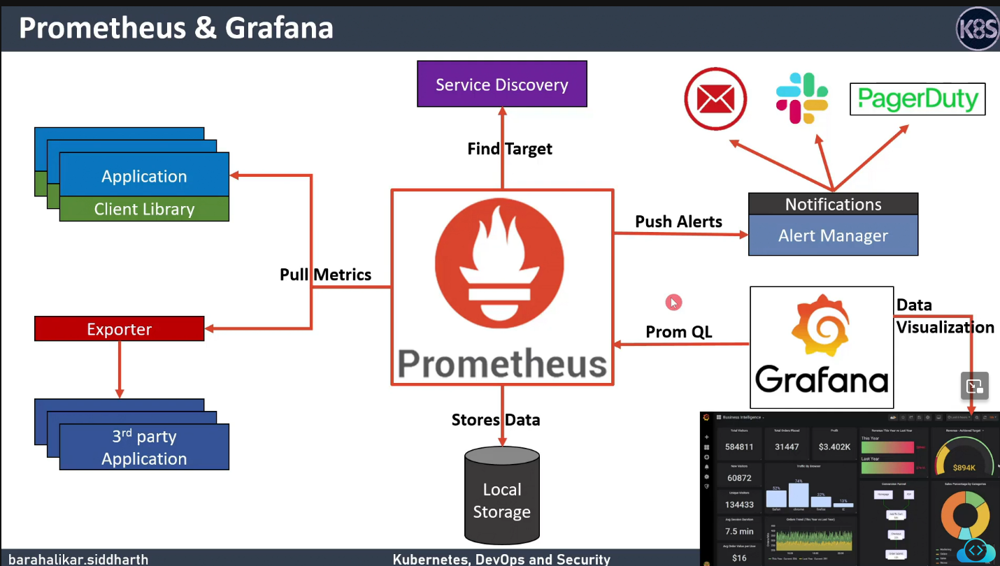

# kubernetes-devops-security


## Deployment on Kubernetes using ArgoCD
ArgoCD will automatically update the Deployemnt if there is any change in the Deployement file
Here I used Jenkins to build and push to Docker Hub with GitHub/Git commit ID tag 

So, here I used Github Actions to update the Kubernetes Deployment File which is present on argocd brach in this repo with Github/Git Commit Id to the docker image tag 
Next Argo CD will pull new Docker image from the Docker Hub and deploy to the Kubernetes 

> Note : I used Jenkins to build and push and Github actions to update commit id to the k8s_deployment_service.yaml (argocd branch) on which is tracked by ArgoCD, if there is any changes to the file ArgoCD will bring our Deployemnt to the Desire state
> I got issues while updating and pushing k8s_deployment_service.yaml to argocd branch using Jenkins, there are ways to solve it. But I want to experiment with Github Actions, I tried updating k8s_deployment_service.yaml and pusing it to argocd branch

I used rollback on ArgoCD dashboard to get to previous docker image, if there is any issue with newer image

## Removing resources 

At first I removed the Deplyment App from Argo CD Dashboard
Next Removing all resources from Argo CD Namespace - pods, deployments, services 
Next Removing Argo CD Namespace 

If you check `kubectl get all -n numeric` you can find no resources (here I named deploying namespace as numeric )


## Plugins

Blueocean

Maven - Maven can be enabled from the tools

Jacoco - for unit testing

Docker pipeline and Docker - for Docker push and for using Docker image in the pipeline

dependency-check-jenkins-plugin -

Sonar - Sonarcloud and Sonarcloud ToDo for the sonar code analysis  - pull and run sonarcube docker image on 9000 port

Sonar docker run
`` docker run -d --name sonarqube -e SONAR_ES_BOOTSTRAP_CHECKS_DISABLE=true -p 9000:9000 sonarqube:latest ``
 
Sonar quality gates config can be changed - change sin limits of the code smells for the new code and overall code


Code for Pitmutation Tests - these tests were failing due to the coverage plugin is deprecated - so not added in the jekinsfile

```Jenkinsfile
stage('Mutation Tests - PIT') {
            steps {
              sh "mvn org.pitest:pitest-maven:mutationCoverage"
              
            }
           post {
              always { 
               pitmutation mutationStatsFile: '**/target/pit-reports/**/mutations.xml'

              pitmutation killRatioMustImprove: false, minimumKillRatio: 50.0, mutationStatsFile: '**/target/pit-reports/**/mutations.xml'
              }
            } 
            
            } 

in pom xml file
 <configuration>
                      <mutationThreshold>75</mutationThreshold>
                      <outputFormats>
                         <outputFormat>XML</outputFormat>
                         <outputFormat>HTML</outputFormat>
                      </outputFormats>
                   </configuration>

```

`` <version>2.2.1.RELEASE</version> ``

## Vulnerability scan 


We can scan the Severity by making changes to code - we can check the CVE on the google and we need to do the required changes to the code and it should not break the code and result - minor change I did here is the chnaging the Spring boot release version - 2.2.1 -> 2.3.4 - by this there Severity got decreased by a margin 

Here I changed failBuildOnCVSS to 11 - to pass build - but the cvss score is based out of 10 as maximum


## Istio Instalation 


```
curl -L https://istio.io/downloadIstio | sh -
cd istio-1.**
export PATH=$PWD/bin:$PATH
istioctl install --set profile=demo -y && kubectl apply -f samples/addons

kubectl label namespace default istio-injection=enabled

```
Addons will install Grafana, Prometheus, Jaeger, Kiali 

Setting Context https://humalect.com/blog/kubectl-config-set-context

## Promotheus 



## Usage Guidance

When to use metric or log data to track a particular piece of telemetry can be summarized with the following points:
### Metrics
   > Use metrics to track the occurrence of an event, counting of items, the time taken to perform an action or to report the current value of a resource (CPU, memory, etc.)

### Logging
   > Use logs to track detailed information about an event also monitored by a metric, particularly errors, warnings or other exceptional situations.

### Traces
   > A trace provides visibility into how a request is processed across multiple services in a microservices environment. Every trace needs to have a unique identifier associated with it.


DNS Spoofing on Kubernetes Clusters : https://blog.aquasec.com/dns-spoofing-kubernetes-clusters

## Fork and Clone this Repo

## Clone to Desktop and VM

##  Microservice - Docker Image -

`docker run -p 8787:5000 hasrhakp06/node-service:v1`

`curl localhost:8787/plusone/99`

##  Microservice - Kubernetes Deployment -

`kubectl create deploy node-app --image harshakp06/node-service:v1`

`kubectl expose deploy node-app --name node-service --port 5000 --type ClusterIP`

`curl node-service-ip:5000/plusone/99`
